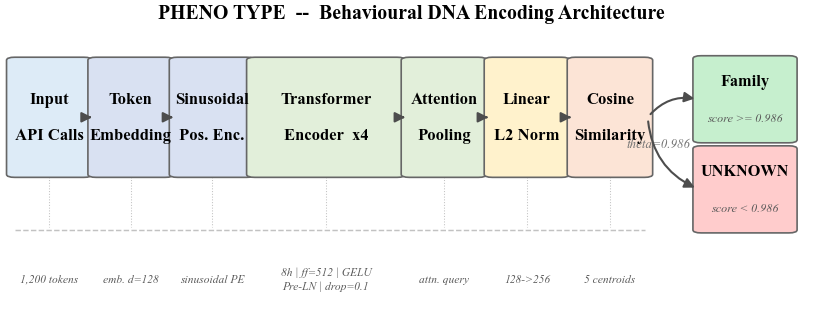
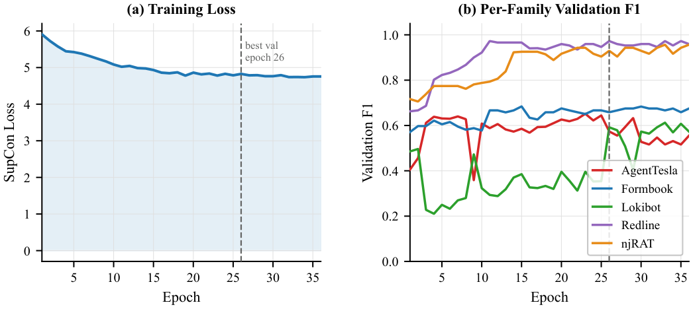
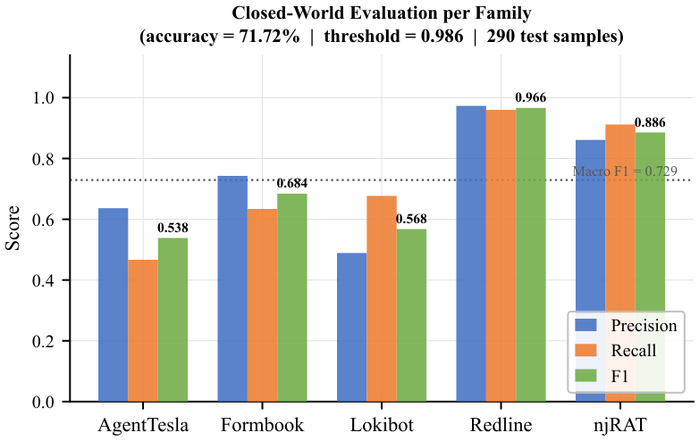
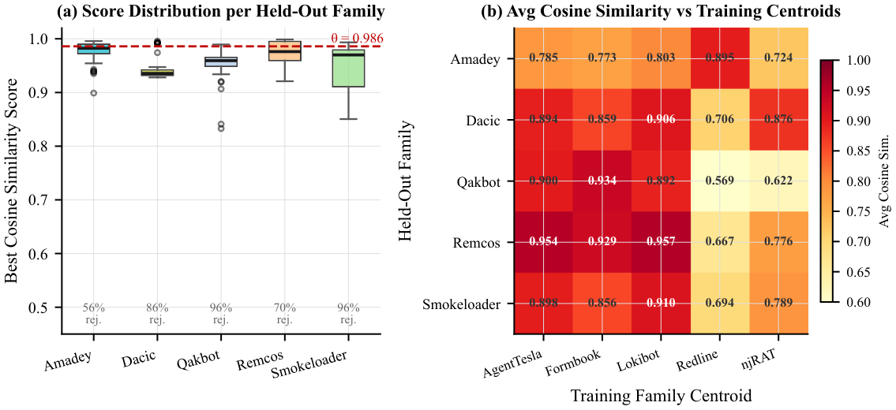

# PHENO TYPE

**Behavioural DNA Framework for Automated Malware Attribution**


> Fingerprint *what malware does*, not what it looks like.
> Survives repacking, polymorphism, and hash-based evasion.

PHENO TYPE encodes sequences of Windows API calls (captured by CAPE Sandbox) into
256-dimensional behavioural fingerprints using a Transformer encoder trained with
Supervised Contrastive Loss. Attribution is performed by cosine similarity against
per-family centroids — with a threshold gate that labels unfamiliar samples as
**UNKNOWN** without retraining.

**[Research Paper](paper/phenotype_malai_2026.pdf)**

---

## Results at a Glance

### Closed-World Attribution (5 families, 290 test samples)

| Family | Precision | Recall | F1 | Support |
|---|---|---|---|---|
| AgentTesla | 0.636 | 0.467 | **0.538** | 75 |
| Formbook | 0.743 | 0.634 | **0.684** | 41 |
| Lokibot | 0.489 | 0.677 | **0.568** | 65 |
| Redline | 0.973 | 0.960 | **0.966** | 75 |
| njRAT | 0.861 | 0.912 | **0.886** | 34 |
| **Macro avg** | 0.740 | 0.730 | **0.729** | **290** |

**Test Accuracy: 71.72%** · Threshold θ = 0.986 · ~680K parameters · 2.7 MB

### Open-World Novelty Rejection (5 unseen families, 250 samples)

| Novel Family | Samples | Rejected as UNKNOWN | Rejection Rate |
|---|---|---|---|
| Amadey | 50 | 28 | 56% |
| Dacic | 50 | 43 | 86% |
| Qakbot | 50 | 48 | 96% |
| Remcos | 50 | 35 | 70% |
| Smokeloader | 50 | 48 | 96% |
| **Overall** | **250** | **202** | **80.8%** |

No retraining required for open-world rejection — only the threshold changes.

---

## Architecture

```
Token Sequence (1,200 × int64)
        │
   Embedding  (vocab = 100 → d = 128, padding_idx = 0)
        │
   Sinusoidal Positional Encoding  (fixed, no learnable params)
        │
   4 × TransformerEncoderLayer
       (d_model = 128, nhead = 8, d_ff = 512, GELU, Pre-LN, dropout = 0.1)
        │
   Attention Pooling  (single learnable query vector)
        │
   Linear (128 → 256)
        │
   L2 Normalise  →  Behavioural Fingerprint (256-dim, unit hypersphere)
        │
   Cosine Similarity vs 5 Family Centroids
        │
   score ≥ 0.986  →  Predicted Family
   score  < 0.986  →  UNKNOWN  (open-world rejection)
```

**Loss**: Supervised Contrastive Loss (`temperature = 0.07`)
**Optimiser**: AdamW (`lr = 3e-4`, `weight_decay = 1e-4`)
**Schedule**: Linear warmup (10%) → cosine decay
**Sampler**: `StratifiedBatchSampler` — every batch contains all 5 families
**Regularisation**: Dropout 0.1, gradient clipping (`max_norm = 1.0`)

---

## Figures

### Figure 1 — System Architecture


### Figure 2 — Training Curves


### Figure 3 — Closed-World Per-Family Results


### Figure 4 — Ablation Study


### Figure 5 — Open-World Rejection Rates


### Figure 6 — Cosine Similarity Distributions


### Figure 7 — Dataset Composition


### Figure 8 — t-SNE Cluster Map


---

## Quickstart

```bash
# 1. Install dependencies
pip install -r requirements.txt

# 2. Train (requires final_dna_v2.csv — see Dataset section)
python train.py --csv final_dna_v2.csv --out_dir outputs/my_run --epochs 100

# 3. Attribute a sample
python attribute.py --csv_row final_dna_v2.csv --row_idx 42 \
    --encoder outputs/my_run/behaviour_encoder.pt \
    --centroids outputs/my_run/family_centroids.pt
```

---

## All Commands

### Train
```bash
python train.py \
    --csv final_dna_v2.csv \
    --out_dir outputs/my_run \
    --epochs 100 \
    --batch_size 64 \
    --device cuda        # or cpu
```

Outputs written to `--out_dir`:

| File | Description |
|---|---|
| `behaviour_encoder.pt` | Best checkpoint (lowest val loss) |
| `family_centroids.pt` | Per-family mean fingerprints |
| `training_log.csv` | Loss + per-family F1 per epoch |
| `test_report.json` | Final test-set metrics |
| `threshold_calibration.png` | Correct vs wrong score distributions |

### Attribute a sample
```bash
# From a CSV row
python attribute.py --csv_row final_dna_v2.csv --row_idx 42 \
    --encoder outputs/my_run/behaviour_encoder.pt \
    --centroids outputs/my_run/family_centroids.pt

# From raw token integers (1,200 space-separated ints)
python attribute.py --tokens "3 22 3 2 3 22 ..."
```

### Explain a prediction (gradient attribution)
```bash
python explain.py \
    --csv_row final_dna_v2.csv --row_idx 0 \
    --encoder outputs/my_run/behaviour_encoder.pt \
    --centroids outputs/my_run/family_centroids.pt \
    --method gradient \
    --out outputs/my_run/explanation.png
```

### Open-world evaluation (held-out families)
```bash
python eval_held_out.py \
    --csv data/held_out_families.csv \
    --encoder outputs/my_run/behaviour_encoder.pt \
    --centroids outputs/my_run/family_centroids.pt \
    --out_dir outputs/my_run
```

### Ablation study
```bash
python ablation.py \
    --csv final_dna_v2.csv \
    --out_dir outputs/ablation_study \
    --device cuda \
    --epochs 50
```

### Confusion matrix
```bash
python confusion_matrix.py \
    --csv final_dna_v2.csv \
    --encoder outputs/my_run/behaviour_encoder.pt \
    --centroids outputs/my_run/family_centroids.pt
```

### t-SNE cluster plot
```bash
python visualise.py \
    --csv final_dna_v2.csv \
    --encoder outputs/my_run/behaviour_encoder.pt \
    --out_dir outputs/my_run
```

### Live dashboard
```bash
streamlit run dashboard.py
```

Upload a CAPE `report.json` or paste a 1,200-token sequence to get:
- Predicted family + confidence score
- All 5 cosine similarity scores
- Top-15 API call attribution chart
- t-SNE placement in the fingerprint space

### Extract tokens from a CAPE report
```bash
python scripts/run_extraction.py \
    --report cape_report.json \
    --vocab data/final_dna_v2_vocab.json \
    --attr        # run attribution immediately after extraction
```

### Generate publication figures
```bash
python scripts/make_paper_figs.py
python scripts/make_tsne.py --mode b   # mode b: no model weights needed
```

---

## Dataset

### What is tracked in this repo
| File | Size | Description |
|---|---|---|
| `data/final_dna_v2_vocab.json` | 2.4 KB | 100-token API vocabulary (2 special + 98 HIGH_SIGNAL API names) |
| `data/held_out_families.csv` | 730 KB | 250 samples from 5 novel families (open-world test set) |
| `outputs/batch_size64/` | — | Published training results and visualisations |

### What is NOT tracked (too large / malware-derived)
`final_dna_v2.csv` (1,932 × 1,203, 5.5 MB) — the training dataset. To reproduce it:

```bash
# Run against WinMET sandbox volumes 1–2
python scripts/run_extraction.py --volumes /path/to/winmet/vol1 /path/to/winmet/vol2

# To add WinMET volumes 3–5 incrementally
python scripts/append_volume.py --volume /path/to/winmet/vol3

# To extract the held-out test set
python scripts/extract_held_out.py --volumes /path/to/winmet/vol1 ...
```

CAPE sandbox reports are required. The vocabulary (`data/final_dna_v2_vocab.json`) is
already provided — the extraction scripts use it directly.

### Training set composition

| Family | Type | Training Samples |
|---|---|---|
| AgentTesla | Credential Stealer + RAT | 500 |
| Formbook | Form Grabber / Keylogger | 272 |
| Lokibot | Password Stealer | 436 |
| Redline | Infostealer | 500 |
| njRAT | Remote Access Trojan | 224 |
| **Total** | | **1,932** |

Each sample is a fixed-length sequence of 1,200 token IDs representing the malware's
Windows API call trace, filtered to 98 HIGH_SIGNAL behavioural indicators.

---

## Ablation Study

| Model Variant | Accuracy | AT F1 | LB F1 | RD F1 | njRAT F1 |
|---|---|---|---|---|---|
| **Transformer + SupCon (Ours)** | 75.17% | 0.607 | 0.597 | **0.980** | **0.938** |
| Transformer + CrossEntropy | 76.21% | 0.542 | 0.663 | 0.973 | 0.889 |
| Transformer + MeanPool | 77.24% | 0.532 | 0.626 | 0.973 | 0.896 |
| TF-IDF + LogReg (Baseline) | 72.41% | **0.637** | 0.447 | 0.980 | 0.923 |

SupCon produces a geometrically structured embedding space (unit hypersphere) that
enables cosine-threshold confidence rejection without any classifier head. CrossEntropy
and MeanPool achieve slightly higher raw accuracy but lose this open-world capability.

---

## Repository Structure

```
phenotype-malai/
├── model.py              — BehaviourEncoder (Transformer + AttentionPooling)
├── dataset.py            — MalwareDataset, StratifiedBatchSampler, make_splits()
├── train.py              — Training loop: SupConLoss, LR schedule, early stopping
├── attribute.py          — Attribution engine: cosine similarity + threshold (θ=0.986)
├── explain.py            — Gradient × input + KernelSHAP explanations
├── eval_held_out.py      — Open-world evaluation on unseen families
├── ablation.py           — 4-variant ablation: SupCon, CrossEntropy, MeanPool, TF-IDF
├── confusion_matrix.py   — Normalised confusion matrix plot
├── visualise.py          — t-SNE fingerprint cluster plot
├── dashboard.py          — Streamlit interactive demo
│
├── scripts/
│   ├── run_extraction.py     — CAPE report.json → 1,200-token sequence
│   ├── append_volume.py      — Append new WinMET volumes to existing dataset
│   ├── extract_held_out.py   — Build held-out test CSV from novel families
│   ├── make_paper_figs.py    — Generate IEEE-quality PDF figures for Overleaf
│   └── make_tsne.py          — Generate publication t-SNE figure
│
├── data/
│   ├── final_dna_v2_vocab.json   — 100-token API vocabulary (frozen)
│   └── held_out_families.csv     — 250-sample open-world test set
│
├── paper/
│   └── phenotype_malai_2026.pdf  — Research paper
│
├── figs/                 — Publication-ready PDF + PNG figures (fig1–fig7 + t-SNE)
├── outputs/
│   └── batch_size64/     — Training logs, test metrics, result visualisations
│
├── requirements.txt
├── LICENSE
└── CITATION.cff
```

---

## Key Findings

**Redline and njRAT** are highly separable in fingerprint space (F1 0.966 and 0.886).
Their API call distributions are distinctive — Redline is dominated by registry writes
and credential file I/O; njRAT by remote thread creation and shell execution.

**AgentTesla and Lokibot** share the system's hardest overlap. Both are credential
stealers relying on the same memory and filesystem primitives (`NtAllocateVirtualMemory`,
`NtCreateFile`, `FindNextFileW`). 48% of AgentTesla test samples are misclassified as
Lokibot. This is a genuine limitation of API-level attribution for this family pair.

**The t-SNE plot** confirms these findings geometrically: Redline and njRAT form tight
well-separated clusters; AgentTesla and Lokibot occupy an overlapping central zone.

**Threshold calibration** shows that raising θ to 0.986 sharply improves precision on
accepted predictions. Wrong predictions concentrate just below this point — making the
UNKNOWN label a meaningful signal rather than a fallback.

---

## Troubleshooting

| Symptom | Fix |
|---|---|
| `TSNE.__init__() unexpected keyword 'n_iter'` | scikit-learn ≥ 1.5: replace `n_iter=` with `max_iter=` in `visualise.py` |
| All samples predicted as one family | Check `StratifiedBatchSampler` and class weights in `dataset.py` |
| All similarities ≈ 0.5 | Adjust temperature (try 0.05–0.15), verify L2 norm is active |
| NaN loss | Reduce LR, confirm gradient clipping is active (`max_norm=1.0`) |
| `charmap codec can't encode` on Windows | Print encoding issue — does not affect output files |
| Extraction: 0 active tokens | Run `print(report.get('behavior',{}).keys())` to inspect CAPE report structure |

---

## Citation

If you use PHENO TYPE in your research, please cite:

```bibtex
@software{phenotype2026,
  author       = {Singh, Harmanpreet and Joshi, Parwaaz},
  title        = {{PHENO TYPE}: Behavioural {DNA} Framework for Malware Attribution},
  year         = {2026},
  publisher    = {GitHub},
  institution  = {Chandigarh University},
  url          = {https://github.com/HarmanpreetSingh/phenotype-malai},
  note         = {Transformer encoder with Supervised Contrastive Loss for
                  Windows API call sequence fingerprinting. 71.72\% closed-world
                  accuracy; 80.8\% open-world rejection across 5 novel families.}
}
```

A `CITATION.cff` file is also provided for GitHub's "Cite this repository" button.

---

## License

MIT — see [LICENSE](LICENSE) for details.

*Supervisor: Prof. Sidrah Fayaz Wani · Chandigarh University · 2026*
